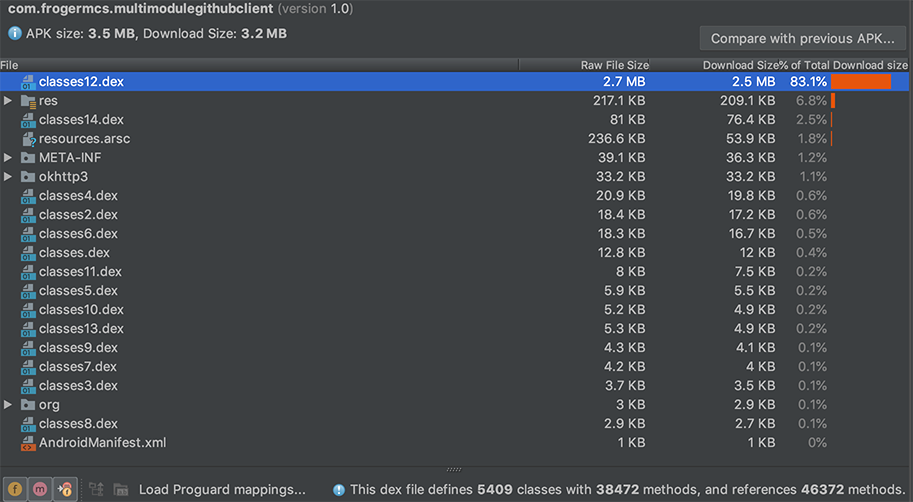
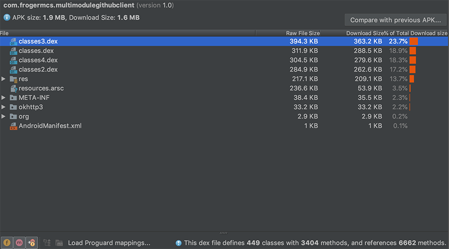

[](https://travis-ci.com/frogermcs/MultiModuleGithubClient)

# MultiModuleGithubClient

Breaking the monolith to microservices is a well-known concept to make backend solutions extendable and maintainable in a scale, by bigger teams. Since mobile apps have become more complex, very often developed by teams of tens of software engineers this concept also grows in mobile platforms. There are many benefits from having apps split into modules/features/libraries:

* features can be developed independently
* project structure is cleaner
* building process can be way faster (e.g., running unit tests on a module can be a matter of seconds, instead of minutes for the entire project)
* great starting point for [instant apps](https://developer.android.com/topic/google-play-instant/)

This is the example project which resolves (or at least workarounds) the most common problems with the multi-module Android app.

## Project structure

The project is a straightforward Github API client containing 3 screens (user search, repositories list, repository details). For the sake of simplicity each screen is a separate module:

* app - application module containing main app screen (user search)
* repositories - repositories list
* repository - repository detail
* base - module containing a code shared between all modules


### Dependencies management
It is easy to get lost with dependencies management across different project modules (especially with libs versions). To make it easier, take a look at `buildsystem/dependencies.gradle` where everything is configured. Each module has separate configuration, with additional two for testing and annotation processing. Like some other patterns, this was originally introduced in [Azimo](https://azimo.com) Android application by [@dbarwacz](https://github.com/dbarwacz).

## Dagger 2

Recently there is no recommended Dagger 2 configuration for multi-module Android project. Some software engineers recommend exposing Dagger modules from Android feature module and use them in Components maintained only in the main App module. This project implements the second way - each feature module has its Component and dependencies tree. All of them depends on Base Component (created in Base module). All have their scope and subcomponents.
This approach was proposed by my colleague [@dbarwacz](https://github.com/dbarwacz) and recently is heavily used in [Azimo](https://azimo.com) Android application.

Here are some highlights from it:

* `BaseComponent` is used as a dependency in feature components (e.g. `RepositoriesFeatureComponent`, `AppComponent`...). It means that all dependencies that are used in  needs to be publicly exposed in `BaseComponent` interface.
* Local components, like `SplashActivityComponent` are subcomponents of feature component (`SplashActivityComponent` is a subcomponent of `AppComponent`).
* Each module has its own Scope (e.g. `RepositoryFeatureScope`, `AppScope`). Effectively they define singletons - they live as long as components, which are maintained by classes: `AppComponentWrapper`, `RepositoryFeatureComponentWrapper` which are singletons... . To have better control on Scopes lifecycle, a good idea would be to add `release()` method to ComponentWrappers.

For the rest take a look at the code - should be self-explaining. As this is just self-invented setup (that works on production!), all kind of feedback is warmly welcomed.


## Unit Testing

Project contains some example unit tests for presenter classes.

### Gradle

To run all unit tests from all modules at once execute:

```
./gradlew testDebugUnitTest
```

In console you can see:

```
...
> Task :app:testDebugUnitTest
com.frogermcs.multimodulegithubclient.SplashActivityPresenterTest > testNavigation_whenUserLoaded_thenShouldNavigateToRepositoriesList PASSED
com.frogermcs.multimodulegithubclient.SplashActivityPresenterTest > testErrorHandling_whenErrorOccuredWhileLoadingUser_thenShouldShowValidationError PASSED
com.frogermcs.multimodulegithubclient.SplashActivityPresenterTest > testValidation_whenUserNameIsInvalid_thenShouldShowValidationError PASSED
com.frogermcs.multimodulegithubclient.SplashActivityPresenterTest > testValidation_whenUserNameValid_thenShouldLoadUser PASSED
com.frogermcs.multimodulegithubclient.SplashActivityPresenterTest > testInit_shouldLogLaunchedScreenIntoAnalytics PASSED

> Task :features:base:testDebugUnitTest
com.frogermcs.multimodulegithubclient.base.ExampleUnitTest > addition_isCorrect PASSED

> Task :features:repositories:testDebugUnitTest
com.frogermcs.multimodulegithubclient.repositories.RepositoriesListActivityPresenterTest > testRepositories_whenRepositoriesAreLoaded_thenShouldBePresented PASSED
com.frogermcs.multimodulegithubclient.repositories.RepositoriesListActivityPresenterTest > testInit_shouldLoadRepositoriesForGivenUser PASSED
com.frogermcs.multimodulegithubclient.repositories.RepositoriesListActivityPresenterTest > testNavigation_whenRepositoryClicked_thenShouldLaunchRepositoryDetails PASSED
com.frogermcs.multimodulegithubclient.repositories.RepositoriesListActivityPresenterTest > testInit_shouldLogLaunchedScreenIntoAnalytics PASSED

> Task :features:repository:testDebugUnitTest
com.frogermcs.multimodulegithubclient.repository.RepositoryDetailsActivityPresenterTest > testUnit_shouldSetRepositoryDetails PASSED
com.frogermcs.multimodulegithubclient.repository.RepositoryDetailsActivityPresenterTest > testInit_shouldSetUserName PASSED
com.frogermcs.multimodulegithubclient.repository.RepositoryDetailsActivityPresenterTest > testInit_shouldLogLaunchedScreenIntoAnalytics PASSED

BUILD SUCCESSFUL in 55s
...
```
It can be useful especially when you run tests on your CI environment. To control logs take a look at file `buildsystem/android_commons.gradle` (it is included in all feature modules).

```
testOptions {
    unitTests {
        all {
            testLogging {
                events 'passed', 'skipped', 'failed'
            }
        }
    }
}
```

In case you want to run unit test in one module, execute:

```
./gradlew clean app:testDebugUnitTest
```
or
```
/gradlew clean feature:repository:testDebugUnitTest
```

### Android Studio

The repository contains shared configurations for running Unit Tests directly from Android Studio.


#### All tests at once

Recently it is not always possible to run all tests at once (see troubleshooting below).

#### All tests, module after module sequentially

Run `App and modules tests`. This configuration will run unit tests from all modules in separate tabs, one after another. To modify list of tests, click on `Edit Configurations` -> `App and modules tests` -> `Before Launch`.


#### Troubleshooting

* **Class not found: ... Empty test suite.**
There is a bug in Android Studio which prevents from launching all unit tests at once, before their code is generated (what happens after the first run of unit tests for every single module independently). For more take a look at Android Studio bug tracker: https://issuetracker.google.com/issues/111154138.


## Test coverage for unit tests

The project contains additional configuration for Jacoco that enables coverage report for Unit Tests (initially Jacoco reports cover Android Instrumentation Tests).

To run tests coverage, execute:

```
./gradlew testDebugUnitTestCoverage
```

Coverage report can be found in `app/build/reports/jacoco/testDebugUnitTestCoverage/html/index.html` (there is also an .xml file in case you would like to integrate coverage report with CI/CD environment.

### Implementation details

Setting up a coverage report for Android Project isn't still straightforward and can take a couple of hours/days of exploration. Example setup in this project could be a little bit easier and more elegant, but some solutions are coded explicitly for better clarity.
Here are some highlights:

* Each module should use Jacoco plugin `apply plugin: 'jacoco'` and config (defined in `android_commons.gradle`):
```
buildTypes {
    debug {
        testCoverageEnabled true
    }
}
```

* App module defines custom Jacoco task called `testDebugUnitTestCoverage`. Entire configuration can be found in `buildsystem/jacoco.gradle`. The code should be self-explaining.

* Task `testDebugUnitTestCoverage` depends on `testDebugUnitTest` tasks (each module separately). Thanks to it all sources required for coverage report are available before gradle starts generating it (in `<module_dir>/build/...`.


## Instrumentation Testing

Project contains example Instrumentation test. 

### Gradle

To run all Instrumentation tests from all modules at once launch emulator or plugin device and execute:

```
./gradlew connectedAndroidTest
```

When all goes fine, you should see testing report in `app/build/reports/androidTests/connected/` directory.


### Functional vs End-to-end testing
From the high level, Android Instrumentation tests can be split into two types: functional and end-to-end. You can check my [article](https://medium.com/azimolabs/automated-testing-will-set-your-engineering-team-free-a89467c40731) about how we do QA at Azimo to see what is the difference between both of them. 

Having in mind multi-feature config, it's pretty likely building functional tests can be more difficult. It's because your modules won't always see each other. In our example `app` module doesn't have knowledge about `feature/repository` module, so it means that instead of code:

```java
intended(hasComponent(RepositoryDetailsActivity.class.getName()));
```

you need to use:

```java
intended(hasComponent("com.frogermcs.multimodulegithubclient.repository.RepositoryDetailsActivity"));
```

It is, because `app` module doesn't have access to `RepositoryDetailsActivity` class.

What about end-to-end tests? They shouldn't be problematic, simply because tests shouldn't have knowledge about specific implementation, but rather how user interface is composed (so again, not: `withText("R.string.show_repos")` but `withText("Show repositories")`). 

More cases: TBD


## Proguard

Proguard configuration isn't very different in standard and multi-feature project configuration. Minification process is enabled in `app/build.gradle` [file](app/build.gradle):

```groovy
buildTypes {
    debug {
        minifyEnabled true
        proguardFiles getDefaultProguardFile('proguard-android.txt'),
                'proguard-rules.pro'
        testProguardFile 'proguard-test-rules.pro'
    }
    //...
}
```

For proguard configuration and know-how we could create completely separate demo project and a bunch of articles. Instead, just take a look at screenshots that compare apk files built from this project, with and without minification enabled.

#### Project without proguard



#### Project with proguard



### Proguard config for project modules

It is also possible to Provide proguard configuration for each module separately. Why would you like to do this? Usually Proguard configuration is set in app's module gradle file. Also all global flags `-dontoptimize` also should be set there.
But sometimes there are module-specific configurations. So for example you would like to keep methods or classes, even if they aren't used in app's module. Also when you share .aar library file, you can provide it with Proguard configuration built in.
In this situation you should use `consumerProguardFiles`. For example, see `features/base/build.gradle` (file)[features/base/feature-base-proguard-rules.pro]:

```groovy
buildTypes {
    all {
        consumerProguardFiles 'feature-base-proguard-rules.pro'
    }
}
```

Configuration tells:

```
-keep class com.frogermcs.multimodulegithubclient.base.BaseActivity {
   public void notUsedMethod();
}
```

It means that method `notUsedMethod()` from class (BaseActivity)[features/base/src/main/java/com/frogermcs/multimodulegithubclient/base/BaseActivity.java] will be kept, no matter what.

For more details, take a look at [this blog post](https://proandroiddev.com/handling-proguard-as-library-developer-or-in-a-multi-module-android-application-2d738c37890) that describes how to setup Proguard for multi-module android app.
